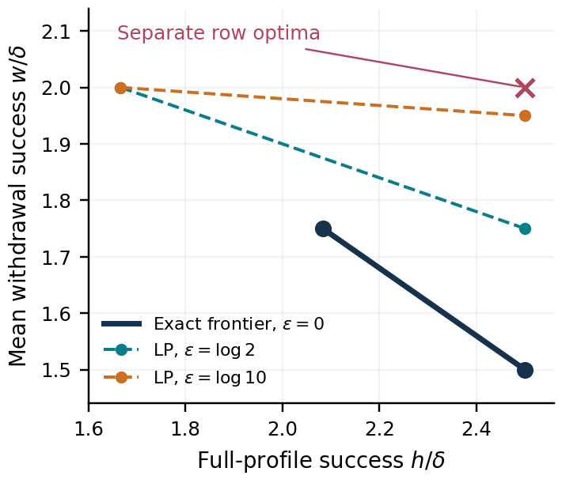

# Consent Lottery

**Private Participation in Agent Contract Selection: Exact Frontiers and Incompatible Optima**  
Shivam Gupta · Independent Researcher · September 2026

Research manuscript and reproducible artifact for a prospective AAMAS 2027 workshop submission. **Not submitted or accepted.** The specific 2027 workshop calls are not yet published; see [submission status](submission/STATUS.md).

[Read the paper](output/pdf/consent-lottery.pdf) · [Literature audit](literature/REVIEW.md) · [Protocol](notes/PROTOCOL.md) · [Technical audit](notes/TECHNICAL_REVIEW.md)



## What the paper establishes

A broker selects at most one public contract. Each contract requires named agents, whose participation bits are private. It must never execute an infeasible contract. The executed identifier or abstention is public.

- At any fixed profile, the attainable contract probabilities are **exactly a fractional packing polytope**: every agent's incident probability mass is at most its delta budget. Every point extends to a globally private fixed lottery with a private veto.
- Those pointwise optima can be mutually incompatible. A **five-agent cycle** has an exact Pareto frontier between success with everyone present and success after one withdrawal.
- Increasing epsilon from zero to log(2) raises optimal mean withdrawal success from **7 delta / 4 to 2 delta**, despite leaving every pointwise optimum unchanged.

The broad conflict between outcome privacy and useful allocations is established prior work. The contribution is the specific exact characterization and compatibility frontier. See the [claim-by-claim literature comparison](literature/REVIEW.md). The code does not demonstrate improved LLM negotiation, deployment performance, or guaranteed publication novelty.

## Evidence

| Evidence | Executed result |
|---|---|
| Complete three-agent menu enumeration | 127 menus × 3 delta values × 2 epsilon values = 762 full-profile LP comparisons |
| Exact packing certificates | 381 rational primal/dual pairs with equal objectives |
| Exact DP verification of saved small mechanisms | All 762 reconstructed distributions verified with fractions |
| Declared cycle experiment | 63 full-profile LP solutions |
| Analytic cycle mechanisms | 63 frontier mixtures + 3 relaxed mechanisms; 675,840 event inequalities |
| Six-agent policy comparisons | 288 comparisons on 24 seeded menus, with exact expectations over all 64 profiles |
| Unit and integration checks | 22 passing tests |

The experimental graph generator and public priors are synthetic. Agreement rates are not deployment measurements. Numerical LPs are checked against full output events, not only singletons. The independent saved-result checker imports neither the solver nor the implementation package.

## Reproduce

Tested with Python 3.9.6, NumPy 2.0.2, SciPy 1.13.1 and Matplotlib 3.9.4 on macOS ARM64. No API key, paid model access, GPU or external dataset is required.

```bash
python3 -m venv .venv
.venv/bin/python -m pip install --upgrade pip
.venv/bin/python -m pip install -r requirements.lock
.venv/bin/python -m pip install -e .
.venv/bin/python -m pytest -q
.venv/bin/python experiments/verify_saved.py
.venv/bin/python experiments/exact_cycle.py
```

To recompute the primary experiments and figures (replaces the saved numerical result files):

```bash
.venv/bin/python experiments/run.py all
.venv/bin/python experiments/verify_saved.py
.venv/bin/python experiments/figures.py
```

Build the paper with Tectonic:

```bash
cd paper
tectonic main.tex --outdir ../output/pdf
```

This writes `main.pdf`; the delivered manuscript is named `consent-lottery.pdf`. The official class is unchanged. Named draft metadata intentionally does not claim publication in conference proceedings. Workshop-specific length, anonymity and formatting requirements must be applied once a matching 2027 call exists.

## Minimal exact sampler

```python
from consent_lottery import Menu
from consent_lottery.broker import OneShotBroker

menu = Menu(3, (0b011, 0b101, 0b110))
broker = OneShotBroker(menu, ["1/20"] * 3, ["1/10"] * 3)
result = broker.select(0b111)  # contract index 0..2, or None
```

Weights and menu must be fixed independently of current private participation. The broker consumes one draw even when an agent vetoes. The object cannot be used twice. It is process-local and does not protect timing, network messages, broker internals, restarts or unaccounted repeated sessions.

## Organization

- `src/consent_lottery/`: packing optimizer, reference full-profile oracle, privacy auditor and rational sampler.
- `experiments/`: declared suites, independent verification, exact cycle checker and plotting.
- `data/raw/`: all primary distributions, solver audits and run manifest.
- `data/processed/`: rational checks, figure summaries and independent verification.
- `paper/`: LaTeX, bibliography and vector figures.
- `literature/`: source URLs, download hashes and novelty comparison. Third-party PDFs are not redistributed.
- `submission/`: venue status, submission fields and required supplementary methodology information.

## Scope and release

The broker is trusted, utilities and contract menus are public, and participation reports are treated as correct. No strategic-truthfulness, patentability, production-security or real-market performance claim is made. Small delta can make throughput very low; that limitation is a primary finding, not a hidden failure case. The full-profile LP scales exponentially.

Code and synthetic data are under the MIT license. The manuscript remains copyright Shivam Gupta. This artifact has not been submitted to arXiv.
